<h1 align="center">👋 ¡Hola! Mi nombre es Juan Manuel</h1>

  💻 Desarrollador de Software &nbsp; | &nbsp; 🚀 Apasionado por la tecnología &nbsp; | &nbsp; 🧠 Aprendizaje continuo

---

### 🎯 Sobre mí

Soy desarrollador de software con experiencia en el diseño, desarrollo y mantenimiento de aplicaciones web modernas.

🔧 Me especializo en **desarrollo Backend y Frontend**, creación y consumo de **APIs REST**, gestión de **bases de datos** y control de versiones utilizando **Git**.

🚀 Me apasiona aprender nuevas tecnologías, resolver problemas y participar en proyectos desafiantes que generen un impacto real.

---

### 🧠 Tecnologías y herramientas

#### 🔙 Backend

  

#### 🎨 Frontend

  

#### 🗄️ Bases de datos

  

#### 🛠️ Herramientas

  

---

### 🚀 Proyectos destacados

* 🎒 **[Sistema de Gestión de Inventarios — SGIA](https://github.com/Jumaga11/SGIA-V2.0)**
  Aplicación web desarrollada con **Express.js y Angular** para la gestión y control de préstamos e inventarios de la bodega de un centro de formación técnica y tecnológica.

* 🧭 **[GameApp](https://github.com/Jumaga11/2613934)**
  Simulador de videojuegos desarrollado utilizando **Laravel**.

---

### 📊 Estadísticas de GitHub

  
  

---

### 📫 Contacto

* ✉️ **Email:** *[jumagadev@hotmail.com](mailto:jumagadev@hotmail.com)*

---

> 💡 *Siempre aprendiendo, creciendo y preparado para nuevos desafíos en el desarrollo de software.*
